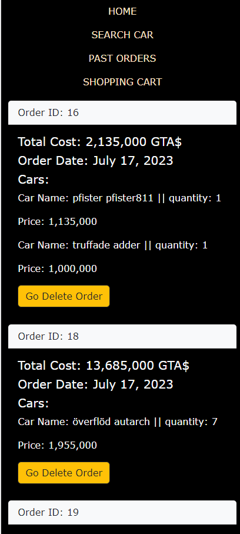
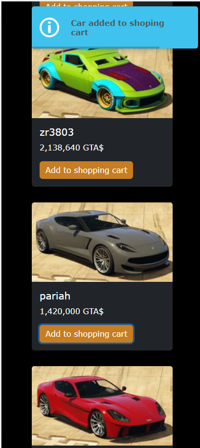
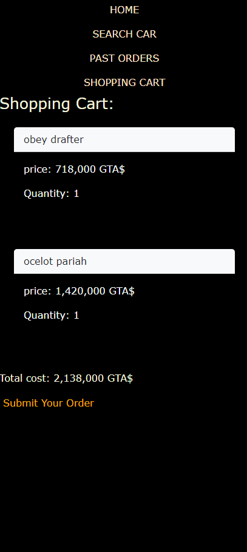

# GTA rides

## Summary
This app is a simulated e comerce powered by React and nodeJS where you can browse GTA cars feeded by an API. You can sorte the by class, top speed and alphabetical order. More importantly, you can add you cars to a shoping Cart, see your total cost, submit your order, and see your past orders.

### Link
https://gta-rides-e-comerce.web.app/register-login

### functionality
- Register and Login
- Photo slider
- Sort vehicles by max speed
- Sort vehicles by alphabetical order (a-z and z-a)
- Select vehicles by class name
- Pagination
- Store past orders and browse them
- Shopping cart

### Screenshots

### Improvements
- a Pop up show up with updated shoping cart each time an item is added

- get data with scrappy web so vehicles are up to date

- Create a new table called cars containing the data of the cars wich are related to an especific order

- vehicle detail component that shows more stats about the vehicle

- Sort vehicles by lap times

- All the sorting optiongs are located in a pop up

- Hability to compare up tu 5 vehciles and their stats
## How to Use
### BackEnd
Run the line npm start on the root folder and npm install to install dependencies. it Runs the app in the development mode.\
Open [https://gta-rides-e-comerce.onrender.com](https://gta-rides-e-comerce.onrender.com) to view it in your browser.

The page will reload when you make changes.\
You may also see any lint errors in the console.

### FrontEnd
Run the line npm start on the client folder and npm install to install dependencies. it Runs the app in the development mode.\
Open [http://localhost:5173](http://localhost:5173) to view it in your browser.

The page will reload when you make changes.\
You may also see any lint errors in the console.